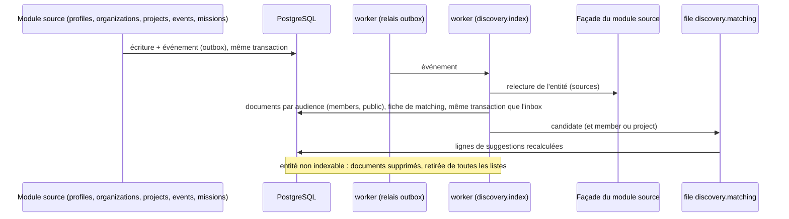
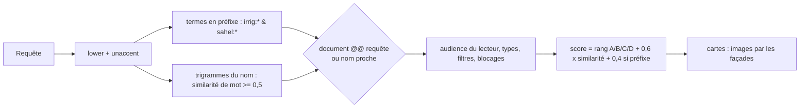
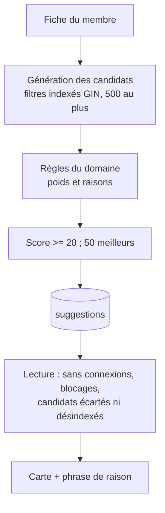

# Découverte : projection, recherche et matching

Module `discovery` (cahier des charges §2.1, §10.2, §10.6, §11.4). Décisions : ADR 0065 (projection par événements), 0066 (multilinguisme et pondération), 0067 (matching à règles explicables), 0068 (précalcul des suggestions). Détails : `apps/server/src/modules/discovery/README.md`.

## Projection

- Documents : texte pondéré (A nom, B sous-titre, C description, D libellés des codes en français et en anglais), attributs filtrables, membre propriétaire (blocages), empreinte SHA-256 du contenu.
- Reconstruction : `pnpm discovery:reindex` relit toutes les sources par les façades (pages de 200 identifiants), supprime les orphelins, puis recalcule toutes les suggestions.
- Dérive : `pnpm discovery:reindex --check` et la tâche quotidienne `check-drift` comparent les empreintes attendues aux empreintes stockées ; un document manquant, périmé ou orphelin est réindexé et la dérive est publiée (`discovery.index.drift-detected.v1`).

## Recherche

- Index : GIN sur le `tsvector`, GIN `gin_trgm_ops` sur le nom normalisé, GIN sur étiquettes, pays et secteurs, B-tree des sections (date de publication, date de fin, date de début).
- Volumétrie mesurée (`test/integration/discovery-volume.spec.ts`, 31 600 documents, 5 000 fiches) : recherche en 17 ms de médiane, calcul des suggestions d'un membre en environ 130 ms ; détails et seuils dans les ADR 0066 et 0068.

## Matching

- Une règle donne un poids et une raison (clé `reasons.<règle>` du namespace `discovery`, paramètres : codes seulement, jamais le nom affiché au-dessus) ; la phrase principale assemble les deux plus lourdes en propositions courtes et neutres en genre, jointes par « · » : « Propose du mentorat · secteur commun : Énergie » (libellés courts des secteurs).
- Mise à jour incrémentale : un profil modifié recalcule les listes de son membre, et sa propre ligne dans les listes des membres qu'il concerne (les relations sont symétriques : les mêmes filtres vus depuis le candidat trouvent les sujets, 2 000 au plus) ; une liste qui ne le concerne plus le perd.

## Page Découvrir

Sections : `recent_projects`, `ending_soon_projects`, `suggested_profiles` (membres), `editorial` (projets mis en avant), `upcoming_events`, `open_missions` ; chacune paginée (`GET /v1/discovery/sections/{section}`), première page de chacune par `GET /v1/discovery/page`.
