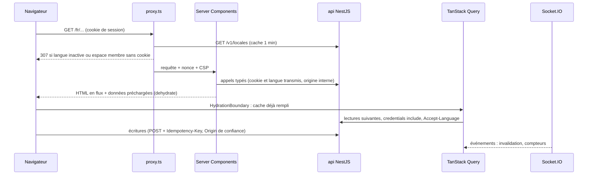

# Frontend (`apps/web`)

Application Next.js 16 (App Router) qui consomme l'api par `@pitchorium/api-client`, les contrats de `@pitchorium/contracts` et les textes de `@pitchorium/i18n`. Elle ne porte aucune règle métier : l'api décide, le web affiche et appelle. Décisions : ADR 0081 à 0091.

## Arborescence

```text
apps/web/
  src/
    app/
      [locale]/
        (marketing)/   pages publiques éditoriales (accueil provisoire)
        (auth)/        connexion, inscription, vérification, réinitialisation, onboarding
        (app)/         espace membre (session exigée, temps réel)
        (public)/      pages publiques indexables (profil, organisation, projet, événement)
        (admin)/       console d'administration (modérateur ou administrateur)
        (dev)/         outils de développement (santé de l'api), 404 en production
        layout.tsx     document : langue, polices, thème, fournisseurs
        not-found.tsx, error.tsx, [...rest]/page.tsx
      sitemap.ts, robots.ts, manifest.ts, global-error.tsx, not-found.tsx
    features/<domaine>/   un dossier par domaine, façade index.ts (identity, localization, marketing, dev)
    components/ui/        primitives du design system, sans métier
    components/motion/    primitives de mouvement et tokens
    components/brand/     logos générés depuis le kit
    components/layout/    coquilles des groupes, en-tête, fournisseurs
    lib/                  api, auth, query, realtime, i18n, sécurité, formats, observabilité
    i18n/                 routage, navigation, configuration par requête de next-intl
    config/               site, routes, SEO, redirections
    styles/               tokens.css, globals.css, polices
    proxy.ts              nonce et CSP, langue active, présence de session
  public/brand, public/fonts   sélection du kit de marque (pnpm brand:sync)
  e2e/                  Playwright et api simulée
  .storybook/           design system
```

## Flux de données



- Premier rendu : les Server Components lisent l'api avec `lib/api/server.ts` (origine `API_INTERNAL_URL`, cookie et `Accept-Language` de la requête entrante, rien d'autre). Le membre courant est lu une fois par requête (`lib/auth/session.ts`).
- Navigateur : `lib/api/browser.ts` configure le client généré (`credentials: include`, `Accept-Language`, une `Idempotency-Key` par POST, sauf clé fournie par l'appelant pour son intention). Toute réponse non 2xx devient une `ApiProblemError` (code RFC 9457, `X-Request-Id`) ; l'interface affiche `errors.<code>`.
- `QueryClient` (`lib/query/query-client.ts`) : données fraîches une minute (pas de nouvelle lecture juste après l'hydratation), conservées cinq minutes, pas de relecture au focus (le temps réel invalide), pas de nouvel essai sur une erreur 4xx, deux sur une erreur réseau ou 5xx, aucune mutation rejouée automatiquement. Un client par requête sur le serveur (`lib/query/server.ts`), un par onglet dans le navigateur ; fourni par les groupes qui lisent l'api depuis le navigateur (`DataProvider`).
- Écritures : jamais de Server Action métier ; le navigateur appelle l'api, qui vérifie l'origine (ADR 0021) et l'idempotence.
- Temps réel (`lib/realtime/realtime-provider.tsx`) : monté par l'espace membre pour un membre connecté ; charges utiles validées par les schémas des contrats ; compteurs écrits dans le cache, notifications et conversations invalidées ; compteurs relus après une reconnexion.
- État d'URL : `nuqs` (filtres, onglets, recherche), fourni par les groupes membre, public et administration.
- Flags : le web ne lit que leurs effets, dont les langues actives (`GET /v1/locales`, ou `activeLocales` de `GET /v1/me`).

## Fournisseurs

`components/layout/providers.tsx`, dans le document de chaque page : `NextIntlClientProvider` (namespaces `common` et `web` seulement), `ThemeProvider` (script inline avec le nonce, aucun flash), `MotionConfig` (nonce, mouvement réduit) et `LazyMotion`, langues actives, toasts, synchronisation du fuseau. Par groupe : `DataProvider` (TanStack Query) et `UrlStateProvider` (nuqs) dans les coquilles membre, administration et publique ; `RealtimeProvider` dans l'espace membre.

## Proxy

`src/proxy.ts` (Next.js 16, Node.js) sur toutes les pages (ni fichiers, ni `_next`, ni préchargements) :

1. nonce aléatoire et CSP (ADR 0088), transmis au rendu par les en-têtes de la requête ;
2. langue (chemins identiques dans toutes les langues, seul le préfixe change, ADR 0092) : une langue connue mais inactive redirige vers la même page en français ; next-intl, configuré avec les seules langues actives, détecte la langue d'une première visite (`Accept-Language`) ou la reprend du cookie `NEXT_LOCALE` ;
3. espace membre (`MEMBER_SEGMENTS`) et administration (`ADMIN_SEGMENTS` de `config/routes.ts`) : sans cookie de session, redirection vers `/<langue>/sign-in?next=...`. Le layout du groupe relit la session par `GET /v1/me` ; l'api reste l'autorité (ADR 0015). Un test vérifie que chaque dossier de `(app)` et `(admin)` figure dans ces listes.

## Configuration

`src/lib/env.ts` valide la configuration (`@t3-oss/env-nextjs`) au chargement de `next.config.ts` : `next build` échoue sur une valeur invalide. Le code du navigateur lit les valeurs publiques, déjà validées et inscrites au build, par `lib/public-env.ts`, sans bibliothèque de validation. Variables : `apps/web/.env.example`.

## Performance

- Budgets (ADR 0090) : JavaScript initial par groupe de routes (Brotli, framework compris, environ 111 kB) : `(marketing)` 240 kB, `(public)` et `(auth)` 260 kB, `(app)` et `(admin)` 300 kB (`pnpm --filter @pitchorium/web check:bundles`) ; Lighthouse mobile : performance 90 ou plus, accessibilité, bonnes pratiques et SEO 100, LCP 2,5 s, CLS 0,1, TBT 300 ms ; INP sous 200 ms mesuré par Playwright sur les gestes principaux (processeur ralenti quatre fois), scripts 360 kB et polices 80 kB transférés (`pnpm --filter @pitchorium/web lighthouse`).
- Mesures du socle (page éditoriale, 4G lente, processeur ralenti quatre fois) : performance 99, LCP 1,6 s, CLS 0, TBT de 10 à 30 ms sur un poste rapide et de 217 à 229 ms sur un runner GitHub, INP de 40 ms ; 236 kB de JavaScript initial.
- Ce qui reste hors du premier chargement : GSAP (chargé quand le titre éditorial approche de l'écran), Sentry (chargé après la page, seulement avec un DSN), TanStack Query et nuqs sur les pages éditoriales, la police manuscrite et le repli Noto Sans (téléchargés par les seules pages qui s'en servent).
- `preconnect` vers l'api (avec les cookies) et le CDN des fichiers depuis le document ; polices auto-hébergées (`next/font/local`), seules Poppins 400 et Bricolage Grotesque 800 préchargées.
- Analyse : `pnpm --filter @pitchorium/web exec next analyze` (Turbopack).

## Tests

- `pnpm --filter @pitchorium/web test` : Vitest (composants en jsdom, logique en Node), tests d'architecture (règles ESLint prouvées sur des violations volontaires, dont React, hooks et accessibilité, ADR 0093 ; listes de routes, plages de la police de repli).
- `pnpm --filter @pitchorium/web test:e2e` : Playwright dans l'image officielle (même rendu que la CI), build de production `.next-e2e` devant `e2e/support/stub-api.mjs` ; captures de référence dans `e2e/__screenshots__`, à mettre à jour par `pnpm --filter @pitchorium/web test:e2e --update-snapshots` après un changement visuel voulu.
- `pnpm --filter @pitchorium/web build-storybook` : design system.
