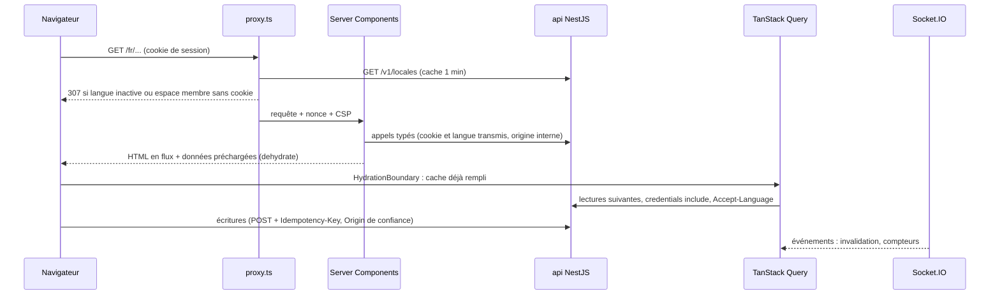

# Frontend (`apps/web`)

Application Next.js 16 (App Router) qui consomme l'api par `@pitchorium/api-client`, les contrats de `@pitchorium/contracts` et les textes de `@pitchorium/i18n`. Elle ne porte aucune règle métier : l'api décide, le web affiche et appelle. Décisions : ADR 0081 à 0091.

## Arborescence

```text
apps/web/
  src/
    app/
      [locale]/
        (marketing)/   pages publiques éditoriales (accueil provisoire)
        (auth)/        connexion, inscription, vérification, réinitialisation, onboarding
        (app)/         espace membre (session exigée, temps réel)
        (public)/      pages publiques indexables (profil, organisation, projet, événement)
        (admin)/       console d'administration (modérateur ou administrateur)
        (dev)/         outils de développement (santé de l'api), 404 en production
        layout.tsx     document : langue, polices, thème, fournisseurs
        not-found.tsx, error.tsx, [...rest]/page.tsx
      sitemap.ts, robots.ts, manifest.ts, global-error.tsx, not-found.tsx
    features/<domaine>/   un dossier par domaine, façade index.ts (access, discovery, identity, localization, marketing, notifications, dev)
    components/ui/        primitives du design system, sans métier
    components/motion/    primitives de mouvement et tokens
    components/brand/     logos générés depuis le kit
    components/layout/    coquilles des groupes (member/, admin/), mises en page, états (states/), fournisseurs
    lib/                  api, auth, query, realtime, i18n, sécurité, formats, observabilité
    i18n/                 routage, navigation, configuration par requête de next-intl
    config/               site, routes, SEO, redirections
    styles/               tokens.css, globals.css, polices
    proxy.ts              nonce et CSP, langue active, présence de session
  public/brand, public/fonts   sélection du kit de marque (pnpm brand:sync)
  e2e/                  Playwright et api simulée
  .storybook/           design system
```

## Flux de données



- Premier rendu : les Server Components lisent l'api avec `lib/api/server.ts` (origine `API_INTERNAL_URL`, cookie et `Accept-Language` de la requête entrante, rien d'autre). Le membre courant est lu une fois par requête (`lib/auth/session.ts`).
- Navigateur : `lib/api/browser.ts` configure le client généré (`credentials: include`, `Accept-Language`, une `Idempotency-Key` par POST, sauf clé fournie par l'appelant pour son intention). Toute réponse non 2xx devient une `ApiProblemError` (code RFC 9457, `X-Request-Id`) ; l'interface affiche `errors.<code>`.
- `QueryClient` (`lib/query/query-client.ts`) : données fraîches une minute (pas de nouvelle lecture juste après l'hydratation), conservées cinq minutes, pas de relecture au focus (le temps réel invalide), pas de nouvel essai sur une erreur 4xx, deux sur une erreur réseau ou 5xx, aucune mutation rejouée automatiquement. Un client par requête sur le serveur (`lib/query/server.ts`), un par onglet dans le navigateur ; fourni par les groupes qui lisent l'api depuis le navigateur (`DataProvider`).
- Écritures : jamais de Server Action métier ; le navigateur appelle l'api, qui vérifie l'origine (ADR 0021) et l'idempotence.
- Temps réel (`lib/realtime/realtime-provider.tsx`) : monté par l'espace membre pour un membre connecté ; charges utiles validées par les schémas des contrats ; compteurs écrits dans le cache, notifications et conversations invalidées ; compteurs relus après une reconnexion.
- État d'URL : `nuqs` (filtres, onglets, recherche), fourni par les groupes membre, public et administration.
- Flags : le web ne lit que leurs effets, dont les langues actives (`GET /v1/locales`, ou `activeLocales` de `GET /v1/me`).

## Fournisseurs

Chaque groupe ne charge que ce qu'il utilise (ADR 0094) :

- document (`components/layout/providers.tsx`, chaque page) : messages du document (`CLIENT_MESSAGES.document`), `ThemeProvider` (script inline avec le nonce, aucun flash), langues actives, synchronisation du fuseau ;
- `ScopedMessages` : messages d'un groupe (`CLIENT_MESSAGES` de `lib/i18n/messages.ts`), seuls les sous-arbres que ses composants clients lisent ;
- `InteractiveRuntime` (coquilles membre, administration, authentification et publique) : messages du groupe, `MotionProvider` (`MotionConfig` avec le nonce, `LazyMotion` strict, animations chargées après la première peinture), toasts ;
- `DataProvider` (TanStack Query et client de l'api du navigateur) et `UrlStateProvider` (nuqs) : coquilles membre, administration et publique ;
- `RealtimeProvider` : espace membre seulement.

## Coquilles

- Espace membre (`components/layout/member`, ADR 0099) : bandeau haut sans barre inférieure, recherche globale, six sections avec compteurs en temps réel, action contextuelle, menu du compte ; sous `lg`, un panneau `Drawer` ; bannières de compte et hors ligne sous le bandeau ; `ThreeColumnLayout` (3, 6, 3 à partir de `xl`) ou `SingleColumnLayout`. Raccourcis : ADR 0098.
- Administration (`components/layout/admin`) : navigation latérale (une feuille sur un téléphone), fil d'Ariane, rôle vérifié par le layout côté serveur (404 sinon).
- Authentification : carte centrée sur les fonds discrets de la marque ; pages publiques et éditoriales : en-tête du site.
- Chaque groupe a son `loading.tsx`, `error.tsx` et `not-found.tsx` (`components/layout/states`) ; le focus passe au contenu après une navigation (`RouteFocus`).
- Du code reste hors du premier chargement mais doit servir hors ligne (aide des raccourcis, palette, infobulles) : il est préchargé quand la page est inactive (`lib/preload.ts`).

Les pages éditoriales n'ont ni données du navigateur, ni temps réel, ni client d'authentification, ni fonctions de Motion, ni toasts. `LayoutMotion` (fonctions de mise en page) n'enveloppe que les composants qui animent une mise en page.

## Proxy

`src/proxy.ts` (Next.js 16, Node.js) sur toutes les pages (ni fichiers, ni `_next`, ni préchargements) :

1. nonce aléatoire et CSP (ADR 0088), transmis au rendu par les en-têtes de la requête ;
2. langue (chemins identiques dans toutes les langues, seul le préfixe change, ADR 0092) : une langue connue mais inactive redirige vers la même page en français ; next-intl, configuré avec les seules langues actives, détecte la langue d'une première visite (`Accept-Language`) ou la reprend du cookie `NEXT_LOCALE` ;
3. espace membre (`MEMBER_SEGMENTS`) et administration (`ADMIN_SEGMENTS` de `config/routes.ts`) : sans cookie de session, redirection vers `/<langue>/sign-in?next=...`. Le layout du groupe relit la session par `GET /v1/me` ; l'api reste l'autorité (ADR 0015). Un test vérifie que chaque dossier de `(app)` et `(admin)` figure dans ces listes.

## Configuration

`src/lib/env.ts` valide la configuration (`@t3-oss/env-nextjs`) au chargement de `next.config.ts` : `next build` échoue sur une valeur invalide. Le code du navigateur lit les valeurs publiques, déjà validées et inscrites au build, par `lib/public-env.ts`, sans bibliothèque de validation. Variables : `apps/web/.env.example`.

## Performance

- Budgets (ADR 0090, ADR 0094) : JavaScript initial par groupe de routes (Brotli, framework compris, environ 112 kB) : `(marketing)` 190 kB, `(public)` et `(auth)` 220 kB, `(app)` 250 kB, `(admin)` 260 kB, autres pages 190 kB (`pnpm --filter @pitchorium/web check:bundles`, qui liste aussi les primitives Radix de chaque page et refuse GSAP, Socket.IO, le client d'authentification et les outils de développement de requêtes hors des groupes qui les utilisent) ; Lighthouse mobile : performance 90 ou plus, accessibilité, bonnes pratiques et SEO 100 (SEO hors espace membre, non indexé), LCP 2,5 s, CLS 0,1, TBT 300 ms ; INP sous 200 ms mesuré par Playwright sur les gestes principaux (processeur ralenti quatre fois), scripts 360 kB et polices 80 kB transférés (`pnpm --filter @pitchorium/web lighthouse`).
- Mesures (4G lente, processeur ralenti quatre fois, mouvement réduit pour juger le contraste au repos, poste rapide) : page éditoriale, performance 99 à 100, accessibilité 100, LCP 1,5 s, CLS 0, TBT de 7 à 32 ms, 180,1 kB de JavaScript initial (236,1 kB au socle) ; espace membre (`/fr/feed`, session de l'api simulée), performance 100, accessibilité 100, LCP 1,5 s, TBT 55 ms, 233,9 kB (308 kB avant le régime) ; administration 194,4 kB.
- Ce qui reste hors du premier chargement : GSAP (chargé quand le titre éditorial approche de l'écran), Sentry (chargé après la page, seulement avec un DSN), les fonctions de Motion, les vues d'erreur, Vercel Analytics, le client d'authentification (au clic de déconnexion), TanStack Query et nuqs sur les pages éditoriales, la police manuscrite et le repli Noto Sans (téléchargés par les seules pages qui s'en servent).
- `preconnect` vers l'api (avec les cookies) et le CDN des fichiers depuis le document ; polices auto-hébergées (`next/font/local`), seules Poppins 400 et Bricolage Grotesque 800 préchargées.
- Analyse : `pnpm --filter @pitchorium/web exec next analyze` (Turbopack).

## Tests

- `pnpm --filter @pitchorium/web test` : Vitest (composants en jsdom, logique en Node), tests d'architecture (règles ESLint prouvées sur des violations volontaires, dont React, hooks et accessibilité, ADR 0093 ; listes de routes, plages de la police de repli).
- `pnpm --filter @pitchorium/web test:e2e` : Playwright dans l'image officielle (même rendu que la CI), build de production `.next-e2e` devant `e2e/support/stub-api.mjs` ; captures de référence dans `e2e/__screenshots__`, à mettre à jour par `pnpm --filter @pitchorium/web test:e2e --update-snapshots` après un changement visuel voulu.
- Les parcours de l'espace membre (`e2e/member-shell.spec.ts`) ouvrent une session par la route de connexion de l'api simulée avec les comptes de démonstration, et pilotent son serveur Socket.IO et son journal des écritures (`/__test/*`) : clavier, raccourcis, recherche, compteurs en temps réel, bannières, rejeu hors ligne sans doublon, axe dans les deux thèmes, administration.
- `pnpm --filter @pitchorium/web test:stories` : chaque story est un test (fonction `play` et addon d'accessibilité), dans les deux thèmes, dans l'image Playwright (`docs/design/components.md`).
- `pnpm --filter @pitchorium/web build-storybook` : design system ; `review:captures` : captures des compositions de référence (`docs/design/review`).
