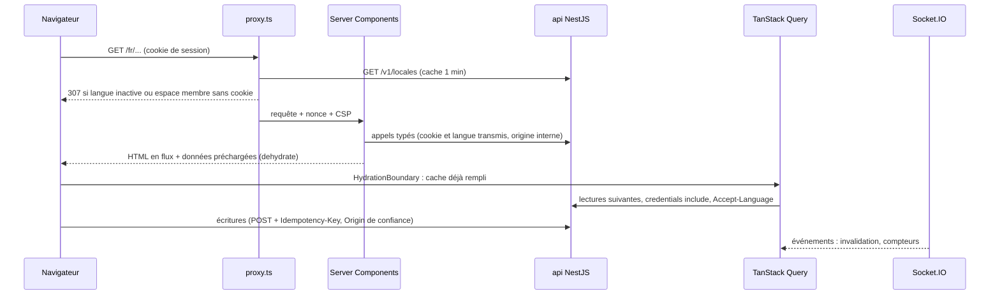

# Frontend (`apps/web`)

Application Next.js 16 (App Router) qui consomme l'api par `@pitchorium/api-client`, les contrats de `@pitchorium/contracts` et les textes de `@pitchorium/i18n`. Elle ne porte aucune règle métier : l'api décide, le web affiche et appelle. Décisions : ADR 0081 à 0091.

## Arborescence

```text
apps/web/
  src/
    app/
      [locale]/
        (marketing)/   pages publiques éditoriales (accueil provisoire)
        (auth)/        connexion, inscription, vérification, réinitialisation, double authentification, `/continue`, onboarding (ADR 0104)
        (app)/         espace membre (session exigée, temps réel)
        (public)/      une adresse par ressource (ADR 0101) : membre, organisation, projet, vitrine, événement ; cadre selon la session
        (admin)/       console d'administration (modérateur ou administrateur)
        (dev)/         outils de développement (santé de l'api), 404 en production
        layout.tsx     document : langue, polices, thème, fournisseurs
        not-found.tsx, error.tsx, [...rest]/page.tsx
      sitemap.ts, robots.ts, manifest.ts, global-error.tsx, not-found.tsx
    features/<domaine>/   un dossier par domaine, façade index.ts (access, content, discovery, identity, localization, marketing, media, messaging, network, notifications, organizations, profiles, projects, dev)
    components/ui/        primitives du design system, sans métier
    components/motion/    primitives de mouvement et tokens
    components/brand/     logos générés depuis le kit
    components/layout/    coquilles des groupes (member/, admin/), mises en page, états (states/), fournisseurs
    lib/                  api, auth, query, realtime, i18n, sécurité, formats, observabilité
    i18n/                 routage, navigation, configuration par requête de next-intl
    config/               site, routes, SEO, redirections
    styles/               tokens.css, globals.css, polices
    proxy.ts              nonce et CSP, langue active, présence de session
  public/brand, public/fonts   sélection du kit de marque (pnpm brand:sync)
  e2e/                  Playwright et api simulée
  .storybook/           design system
```

## Flux de données



- Premier rendu : les Server Components lisent l'api avec `lib/api/server.ts` (origine `API_INTERNAL_URL`, cookie et `Accept-Language` de la requête entrante, et l'adresse du visiteur signée pour la limitation de débit de l'api, `X-Pitchorium-Client-Address`, ADR 0115, derrière `WEB_TRUST_PROXY_HOPS` proxys de confiance). Le membre courant est lu une fois par requête (`lib/auth/session.ts`).
- Messages du navigateur : chaque groupe envoie ses sous-arbres (`CLIENT_MESSAGES`) ; l'espace membre y ajoute ceux du fil et des suggestions (`discovery`, libellés de `reference`), pour construire une phrase de raison dans le navigateur aussi.
- Navigateur : `lib/api/browser.ts` configure le client généré (`credentials: include`, `Accept-Language`, une `Idempotency-Key` par POST, sauf clé fournie par l'appelant pour son intention). Toute réponse non 2xx devient une `ApiProblemError` (code RFC 9457, `X-Request-Id`) ; l'interface affiche `errors.<code>`.
- `QueryClient` (`lib/query/query-client.ts`) : données fraîches une minute (pas de nouvelle lecture juste après l'hydratation), conservées cinq minutes, pas de relecture au focus (le temps réel invalide), pas de nouvel essai sur une erreur 4xx, deux sur une erreur réseau ou 5xx, aucune mutation rejouée automatiquement. Un client par requête sur le serveur (`lib/query/server.ts`), un par onglet dans le navigateur ; fourni par les groupes qui lisent l'api depuis le navigateur (`DataProvider`).
- Écritures : jamais de Server Action métier ; le navigateur appelle l'api, qui vérifie l'origine (ADR 0021) et l'idempotence. Hors ligne, une écriture attend le réseau (ADR 0097) ; un message, une réaction ou un commentaire en attente sont gardés dans IndexedDB pour leur membre et rejoués à la prochaine ouverture (ADR 0102).
- Temps réel (`lib/realtime/realtime-provider.tsx`) : monté par l'espace membre pour un membre connecté ; charges utiles validées par les schémas des contrats ; compteurs écrits dans le cache, notifications et conversations invalidées ; compteurs relus après une reconnexion.
- État d'URL : `nuqs` (filtres, onglets, recherche), fourni par les groupes membre, public et administration.
- Flags : le web ne lit que leurs effets, dont les langues actives (`GET /v1/locales`, ou `activeLocales` de `GET /v1/me`).

## Authentification et onboarding (ADR 0104, 0105)

- Les écrans de `(auth)` lisent `GET /v1/auth-configuration` côté serveur (`lib/auth/configuration.ts`) : fournisseurs OAuth, Turnstile (script de Cloudflare chargé par ces seuls écrans, cadre permis par la CSP), versions des conditions. Le client Better Auth se charge au premier envoi ; `authCall` y ajoute le jeton Turnstile et lit le délai d'une limite.
- Toute connexion revient à `/continue?redirectTo=` (serveur) : conditions à accepter d'abord, puis la page demandée, validée sur la même origine (`lib/auth/redirect.ts`, aussi pour le proxy). Un nouveau compte passe par `/onboarding` (conditions, intention, profil minimum).
- Prérequis : `PrerequisiteGateProvider` (coquille membre) et `useWithPrerequisites` ouvrent le formulaire de chaque élément manquant puis rejouent l'action ; dialogue et formulaires chargés au premier refus. Les éléments viennent tous de l'api (ADR 0109) : l'entrée de l'administration et la bannière de double authentification lisent `GET /v1/me/prerequisites/trust.moderation.read`.
- Paramètres : `/settings/account`, `/settings/security`, `/settings/privacy` (confidentialité et réseau), `/settings/organizations` (« Mes organisations », aussi dans le menu du compte), `/settings/preferences`, une adresse par section ; `(admin)` renvoie vers la sécurité un rôle privilégié dont l'api demande la double authentification.

## Profils, organisations et réseau (PROMPT FRONT 3)

- Pages : `/members/{handle}` et `/organizations/{slug}` (vue publique ou membre, ADR 0101 et 0113), `/members/{handle}/network` (listes du membre selon sa confidentialité), `/network` (invitations reçues et envoyées, suggestions, listes du membre, onglet dans l'adresse), `/network/profile-views`, `/organizations/new`, `/organizations/{slug}/manage`, `/invitations/{jeton}` (sans référent, jamais indexée).
- Features : `profiles` (page, édition en place, force, aperçu `MemberHoverCard`, volets comme formulaires de prérequis), `network` (relation et ses actions, listes paginées `useCursorList`, page du réseau, visites, `FollowButton`, partie réseau des paramètres), `organizations` (page, création, gestion, invitation, « Mes organisations »), `media` (envoi par le module media, `ImageCropDialog`, ADR 0111). `organizations` lit `profiles` et `network` est passé en emplacement par la page (`actions`) : aucun cycle entre features.
- Mises à jour optimistes avec retour arrière (ADR 0112) ; compteurs d'invitations lus dans la clé des compteurs, écrite par le temps réel.
- Référencement : JSON-LD `Person` et `Organization` sur les vues publiques, images Open Graph et X par ressource (`lib/seo/resource-share-image.tsx`), plan du site lu dans les listes publiques de l'api, `noindex` sur les vues membres, la gestion et les invitations.

## Fournisseurs

Chaque groupe ne charge que ce qu'il utilise (ADR 0094) :

- document (`components/layout/providers.tsx`, chaque page) : messages du document (`CLIENT_MESSAGES.document`), `ThemeProvider` (script inline avec le nonce, aucun flash), langues actives, synchronisation du fuseau ;
- `ScopedMessages` : messages d'un groupe (`CLIENT_MESSAGES` de `lib/i18n/messages.ts`), seuls les sous-arbres que ses composants clients lisent ;
- `InteractiveRuntime` (coquilles membre, administration, authentification et publique) : messages du groupe, toasts ;
- `DataProvider` (TanStack Query et client de l'api du navigateur) et `UrlStateProvider` (nuqs) : coquilles membre, administration et publique ;
- `RealtimeProvider` : espace membre seulement.

## Coquilles

- Espace membre (`components/layout/member`, ADR 0099) : bandeau haut sans barre inférieure, recherche globale, six sections avec compteurs en temps réel, action contextuelle, menu du compte ; sous `lg`, Messages et Notifications restent au bandeau avec leurs compteurs, les autres sections, les projets suivis, l'action et le compte dans un panneau `Drawer` ; bannières de compte et hors ligne sous le bandeau ; `ThreeColumnLayout` (3, 6, 3 à partir de `xl`, colonnes latérales absentes sous `lg`, leur contenu repris par la page) ou `SingleColumnLayout`. Raccourcis : ADR 0098.
- Administration (`components/layout/admin`) : navigation latérale (une feuille sur un téléphone), fil d'Ariane, rôle vérifié par le layout côté serveur (404 sinon).
- Authentification : carte centrée sur les fonds discrets de la marque ; pages éditoriales : en-tête du site.
- Pages de ressources (`(public)`, ADR 0101) : une adresse par ressource ; la mise en page suit la session (cadre membre pour un membre, cadre public indexable pour un visiteur) ; `lib/resources/view.ts` lit la vue membre ou la vue publique, et une ressource absente pour le lecteur répond 404.
- Chaque groupe a son `loading.tsx`, `error.tsx` et `not-found.tsx` (`components/layout/states`) ; le focus passe au contenu après une navigation (`RouteFocus`).
- Du code reste hors du premier chargement mais doit servir hors ligne (aide des raccourcis, palette, infobulles) : il est préchargé quand la page est inactive (`lib/preload.ts`).

Les pages éditoriales n'ont ni données du navigateur, ni temps réel, ni client d'authentification, ni fonctions de Motion, ni toasts. Motion n'est chargé que par l'indicateur partagé, à l'inactivité de la page.

## Proxy

`src/proxy.ts` (Next.js 16, Node.js) sur toutes les pages (ni fichiers, ni `_next`, ni préchargements) :

1. nonce aléatoire et CSP (ADR 0088), transmis au rendu par les en-têtes de la requête ;
2. langue (chemins identiques dans toutes les langues, seul le préfixe change, ADR 0092) : une langue connue mais inactive redirige vers la même page en français ; next-intl, configuré avec les seules langues actives, détecte la langue d'une première visite (`Accept-Language`) ou la reprend du cookie `NEXT_LOCALE` ;
3. espace membre (`MEMBER_SEGMENTS`) et administration (`ADMIN_SEGMENTS` de `config/routes.ts`) : sans cookie de session, redirection vers `/<langue>/sign-in?next=...`. Les pages de ressources et la vitrine (`/projects`) n'en font pas partie : publiques, elles suivent la session sans l'exiger. Le layout du groupe relit la session par `GET /v1/me` ; l'api reste l'autorité (ADR 0015). Un test vérifie que chaque dossier de `(app)` et `(admin)` figure dans ces listes.

## Configuration

`src/lib/env.ts` valide la configuration (`@t3-oss/env-nextjs`) au chargement de `next.config.ts` : `next build` échoue sur une valeur invalide. Le code du navigateur lit les valeurs publiques, déjà validées et inscrites au build, par `lib/public-env.ts`, sans bibliothèque de validation. Variables : `apps/web/.env.example`.

## Performance

- Budgets (ADR 0090, ADR 0094) : JavaScript initial par groupe de routes (Brotli, framework compris, environ 112 kB) : `(marketing)` 190 kB, `(auth)` 220 kB, `(public)`, l'onboarding (`(auth)/onboarding`) et `(app)` 250 kB, `(admin)` 260 kB, autres pages 190 kB (`pnpm --filter @pitchorium/web check:bundles`, qui liste aussi les primitives Radix de chaque page et refuse GSAP, Socket.IO, le client d'authentification et les outils de développement de requêtes hors des groupes qui les utilisent) ; Lighthouse mobile : performance 90 ou plus, accessibilité, bonnes pratiques et SEO 100 (SEO hors espace membre, non indexé), LCP 2,5 s, CLS 0,1, TBT 300 ms (250 ms à chaque passage pour `/fr/feed`) ; INP sous 200 ms mesuré par Playwright sur les gestes principaux (processeur ralenti quatre fois), scripts 360 kB et polices 80 kB transférés (`pnpm --filter @pitchorium/web lighthouse`).
- Mesures (4G lente, processeur ralenti quatre fois, mouvement réduit pour juger le contraste au repos, poste rapide) : page éditoriale, performance 99 à 100, accessibilité 100, LCP 1,5 s, CLS 0, TBT de 7 à 32 ms, 180,1 kB de JavaScript initial (236,1 kB au socle) ; espace membre (`/fr/feed`, session de l'api simulée), performance 100, accessibilité 100, LCP 1,5 s, TBT de 11 à 24 ms, 202,0 kB (308 kB avant le régime) ; administration 194,6 kB ; connexion (`/fr/sign-in`) et première étape de l'onboarding (`/fr/onboarding/terms`, ajoutées aux pages mesurées), performance 99, accessibilité 100, LCP 1,6 s, TBT de 10 à 14 ms, 215 et 227 kB. Révision du FRONT 3 (A9) : les écrans d'authentification passent de 215 à 192,6 kB au plus (`/check-email` 173,8 kB), soit 12,5 % de marge sous le budget de 220 kB, inchangé ; la sécurité des paramètres de 247,6 à 224,8 kB : Zod, le résolveur et les schémas de leurs formulaires ne sont plus dans le premier chargement, et le registre des codes d'erreur des contrats ne charge plus Zod. Total Blocking Time de `/fr/feed` (A9, poste local ralenti dix fois, équivalent mesuré du runner ralenti quatre fois) : 266, 350 et 276 ms avant (CI : 244, 256 et 351 ms, seuil jugé sur la médiane), 273 à 322 ms après la première page rendue par le serveur, l'infobulle des dates montée au premier survol, les initiales d'avatar sans hydratation, le temps réel, le fuseau, les toasts et Motion différés à l'inactivité ; sur le runner GitHub ensuite : 73, 76 et 80 ms ; seuil de 250 ms désormais exigé à chaque passage.
- Révision du FRONT 3 : `(public)` passe de 220 à 250 kB, le budget de `(app)`. Un membre y lit la vue membre d'un profil, d'une organisation ou de son réseau dans le cadre de l'espace membre (relation et ses actions, édition en place, listes) ; le manifeste réunit les deux cadres (208,7 kB pour la vitrine, sans code de page), alors qu'un visiteur ne télécharge que le cadre public, suivi par Lighthouse sur le profil public et l'organisation. Mesures (`check:bundles`, sans Sentry ni Vercel Analytics) : profil 223,9 kB, réseau d'un membre 227,6 kB, gestion d'une organisation 220,5 kB, organisation 219,6 kB, création 209,9 kB, invitation 211,1 kB ; `(app)` : réseau 231,2 kB, visites 226,8 kB, confidentialité 224,1 kB. Pour y tenir : `AlertDialog`, `HoverCard`, le détail d'`ImpactBadge` et l'infobulle de `VerifiedBadge` chargés à la première ouverture ou au premier survol, `DeferredSelect` et `DeferredCombobox` dans les formulaires d'une page, `FormActions` hors du module des formulaires (react-hook-form), schémas des formulaires d'organisation chargés par des fonctions, onglets de la gestion, formulaire de création et force du profil chargés après la page, aucune constante des contrats dans un premier chargement (elle y ferait entrer Zod).
- Ce qui reste hors du premier chargement : la validation des formulaires (Zod configuré, résolveur de react-hook-form et schéma, chargés à l'inactivité de la page ou à la première vérification ; un écran qui passe une fonction de chargement à `useZodForm` garde aussi le schéma hors du premier chargement), GSAP (chargé quand le titre éditorial approche de l'écran), Sentry (chargé après la page, seulement avec un DSN), les fonctions de Motion, les vues d'erreur, Vercel Analytics, le client d'authentification (au clic de déconnexion), Zod et les schémas des événements temps réel (au premier événement reçu), le menu du compte (Radix DropdownMenu, à l'inactivité ou au premier usage), TanStack Query et nuqs sur les pages éditoriales, la police manuscrite et le repli Noto Sans (téléchargés par les seules pages qui s'en servent).
- `preconnect` vers l'api (avec les cookies) et le CDN des fichiers depuis le document ; polices auto-hébergées (`next/font/local`), seules Poppins 400 et Bricolage Grotesque 800 préchargées.
- Analyse : `pnpm --filter @pitchorium/web exec next analyze` (Turbopack).

## Tests

- `pnpm --filter @pitchorium/web test` : Vitest (composants en jsdom, logique en Node), tests d'architecture (règles ESLint prouvées sur des violations volontaires, dont React, hooks et accessibilité, ADR 0093 ; listes de routes, plages de la police de repli).
- Révision du FRONT 3 : `(public)` passe de 220 à 250 kB, le budget de `(app)`. Un membre y lit la vue membre d'un profil, d'une organisation ou de son réseau dans le cadre de l'espace membre (relation et ses actions, édition en place, listes) ; le manifeste réunit les deux cadres (208,7 kB pour la vitrine, sans code de page), alors qu'un visiteur ne télécharge que le cadre public, suivi par Lighthouse sur le profil public et l'organisation. Mesures (`check:bundles`, sans Sentry ni Vercel Analytics) : profil 223,9 kB, réseau d'un membre 227,6 kB, gestion d'une organisation 220,5 kB, organisation 219,6 kB, création 209,9 kB, invitation 211,1 kB ; `(app)` : réseau 231,2 kB, visites 226,8 kB, confidentialité 224,1 kB. Pour y tenir : `AlertDialog`, `HoverCard`, le détail d'`ImpactBadge` et l'infobulle de `VerifiedBadge` chargés à la première ouverture ou au premier survol, `DeferredSelect` et `DeferredCombobox` dans les formulaires d'une page, `FormActions` hors du module des formulaires (react-hook-form), schémas des formulaires d'organisation chargés par des fonctions, onglets de la gestion, formulaire de création et force du profil chargés après la page, aucune constante des contrats dans un premier chargement (elle y ferait entrer Zod).
- `pnpm --filter @pitchorium/web test:e2e` : Playwright dans l'image officielle (même rendu que la CI), build de production `.next-e2e` devant `e2e/support/stub-api.mjs`, dans quatre projets : `chromium`, `firefox`, `webkit` (bureau) et `iphone` (WebKit en iPhone 15, parcours étiquetés `@phone` : une partie de la diaspora lit Pitchorium dans Safari sur iPhone). Un seul worker : l'api simulée garde un état commun. Les captures de référence (`e2e/__screenshots__`) et l'INP (CDP) restent propres à Chromium ; à mettre à jour par `pnpm --filter @pitchorium/web test:e2e --project=chromium --update-snapshots` après un changement visuel voulu. Firefox garde la page dans un seul processus malgré `Cross-Origin-Opener-Policy` (préférence de test) : sinon il perd le thème du système émulé.
- Les parcours de l'espace membre (`e2e/member-shell.spec.ts`) ouvrent une session par la route de connexion de l'api simulée avec les comptes de démonstration, et pilotent son serveur Socket.IO et son journal des écritures (`/__test/*`) : clavier, raccourcis, recherche, compteurs en temps réel, bannières, rejeu hors ligne sans doublon, axe dans les deux thèmes, administration.
- `pnpm --filter @pitchorium/web test:e2e:live` : parcours contre la vraie api (`e2e-live`, `scripts/e2e-live.sh`), exécutés dans la CI (job `live-tests`) et par `verify:clean`. Le script démarre un projet Docker Compose isolé (PostgreSQL, Valkey, MinIO, Mailpit, ClamAV) sur des ports décalés, applique les migrations et les données de démonstration, construit et lance l'api, le worker et le web (`next start`, dossier `.next-live`), le service des faux fournisseurs OAuth (`apps/server/test/oauth/server.ts`, port `FAKE_OAUTH_PORT`) avec la redirection des appels de l'api vers lui (`test/oauth/reroute.ts`), puis lance Playwright dans son image officielle. Le navigateur atteint la page de consentement du faux fournisseur (`consentAs`, qui annonce l'identité et détourne l'adresse de Google vers lui) ; Cloudflare Turnstile tourne avec ses clés de test officielles (celle qui réussit toujours ; celle qui échoue toujours est substituée dans la page par le parcours qui la vérifie, avec la surveillance des violations de la CSP). Les membres d'un parcours se créent par l'api (`apiMember`, jeton de test de Turnstile) ; Chromium exécute tous les parcours, Firefox et WebKit ceux étiquetés `@critical` (authentification, onboarding, profils, organisations, réseau) ; les parcours du FRONT 3 (`network.spec.ts`, `profiles.spec.ts`, `organizations.spec.ts`) ouvrent deux membres dans deux contextes, envoient des images dessinées par le navigateur (`pngImage`) et attendent le worker pour les vérifications des fichiers et l'écriture des visites. Arrêt propre : groupes de processus enregistrés, projet Compose supprimé, y compris sur interruption.
- `pnpm --filter @pitchorium/web test:stories` : chaque story est un test (fonction `play` et addon d'accessibilité), dans les deux thèmes, dans l'image Playwright (`docs/design/components.md`).
- `pnpm --filter @pitchorium/web build-storybook` : design system ; `review:captures` : captures des compositions de référence (`docs/design/review`).
