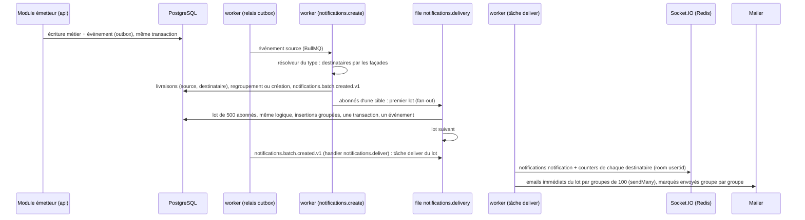
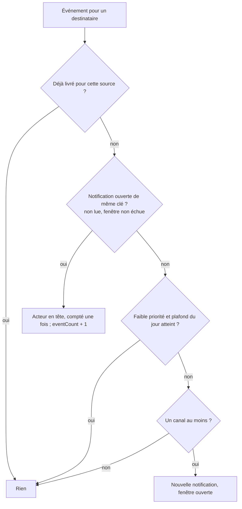
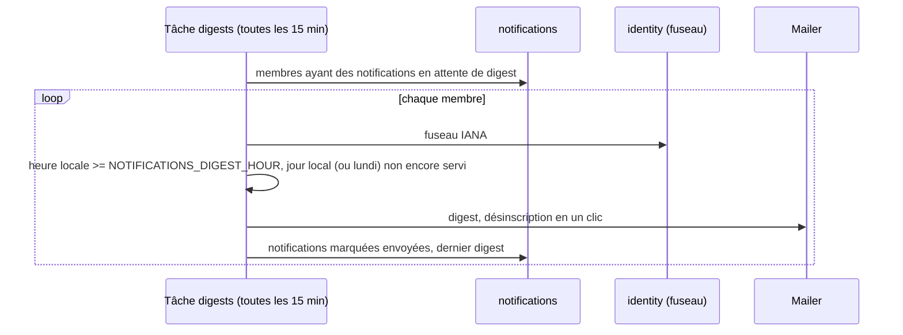

# Notifications

Module `notifications` (cahier des charges §10.5, avec §10.4 et §14). Décisions : ADR 0059 (registre et regroupement), 0064 (livraison par lots), 0060 (préférences et types transactionnels), 0061 (digests et fuseaux), 0062 (délivrabilité). Détails du module : `apps/server/src/modules/notifications/README.md`.

## Du fait métier à la notification

Pour 5 000 abonnés qui ont demandé l'email : 82 tâches et 50 s, contre 10 012 tâches et 166 s quand chaque notification et chaque email avaient leur tâche (ADR 0064).

## Regroupement

- Clé : `type:cible` (réactions, commentaires, messages d'une conversation, contributions d'un projet...), `type` (abonnés, demandes de connexion, publications des membres suivis...) ou unique par événement.
- Exemple : trois réactions sur une même publication dans la fenêtre donnent une notification « Amina et 2 autres ont réagi à votre publication » (`actorCount` 3, `eventCount` 3, acteurs les plus récents en tête).

## Canaux

| Mode email  | Quand                                                                                                                      |
| ----------- | -------------------------------------------------------------------------------------------------------------------------- |
| `immediate` | email du type activé, pas de digest choisi, priorité normale ; toujours pour un type transactionnel dont l'email est prévu |
| `digest`    | email du type activé et digest `daily` ou `weekly` choisi (types non transactionnels)                                      |
| `off`       | email du type désactivé, faible priorité sans digest, type `message` (copie des non lus à part)                            |

## Digests et fuseaux

## Liens profonds

Chaque notification porte `target` : un type, une clé et le chemin de l'application web (contrat avec le frontend, `pathOf`) :

| Cible                      | Chemin                           |
| -------------------------- | -------------------------------- |
| `member`                   | `/members/<handle>`              |
| `post`                     | `/posts/<id>`                    |
| `conversation`             | `/messages/<id>`                 |
| `message_requests`         | `/messages/requests`             |
| `introduction`             | `/introductions/<id>`            |
| `project`                  | `/projects/<slug>`               |
| `project_invitations`      | `/me/project-invitations`        |
| `organization`             | `/organizations/<slug>`          |
| `organization_invitations` | `/me/organization-invitations`   |
| `contribution`             | `/me/contributions/<id>`         |
| `payout_account`           | `/me/payout-account`             |
| `offline_contribution`     | `/me/offline-contributions/<id>` |
| `time_entry`               | `/me/time-entries/<id>`          |
| `profile_views`            | `/me/profile-views`              |
| `connection_requests`      | `/network/requests`              |
| `account_security`         | `/me/security`                   |
| `event`                    | `/events/<slug>`                 |
| `mission_engagement`       | `/missions/engagements/<id>`     |
| `suggestions`              | `/discover`                      |

## Compteurs unifiés

`GET /v1/me/counters` et l'événement `counters` : notifications non lues (in-app), messages non lus et conversations concernées, demandes de message, invitations en attente (connexions, introductions, équipes de projet, organisations de l'adresse vérifiée). Poussés à chaque notification créée ou regroupée et à chaque lecture.

## Valeurs provisoires

Canaux par défaut de chaque type, fenêtre de regroupement (24 h), taille des lots de création et de livraison (500), plafond de faible priorité (20 par jour), délai de la copie des messages non lus (30 min), heure des digests (8 h locale), jour du digest hebdomadaire (lundi), rétention (90 jours) : `docs/open-questions.md`.
