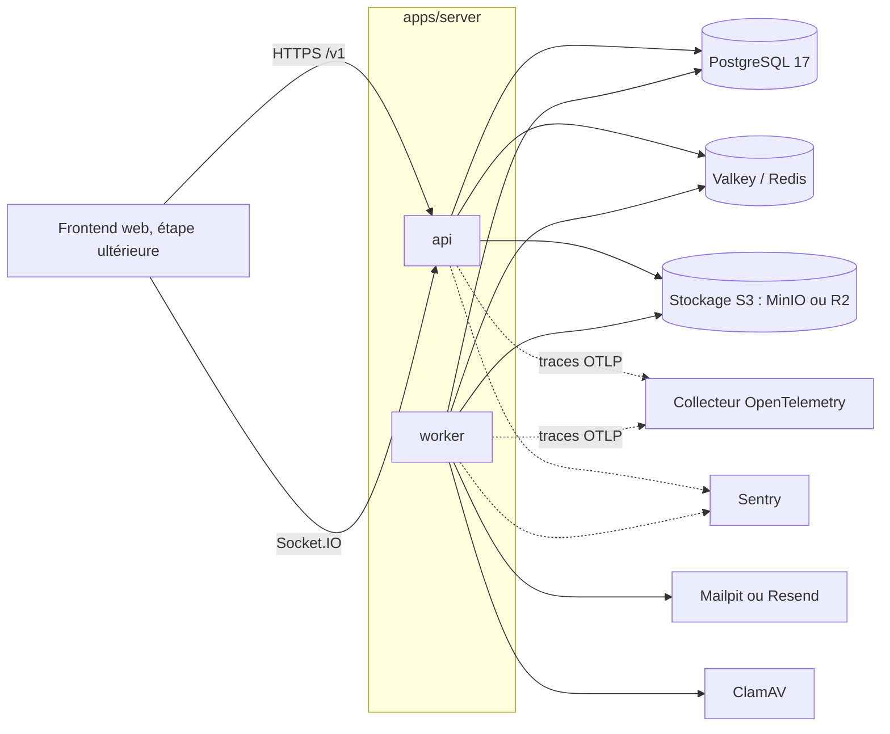
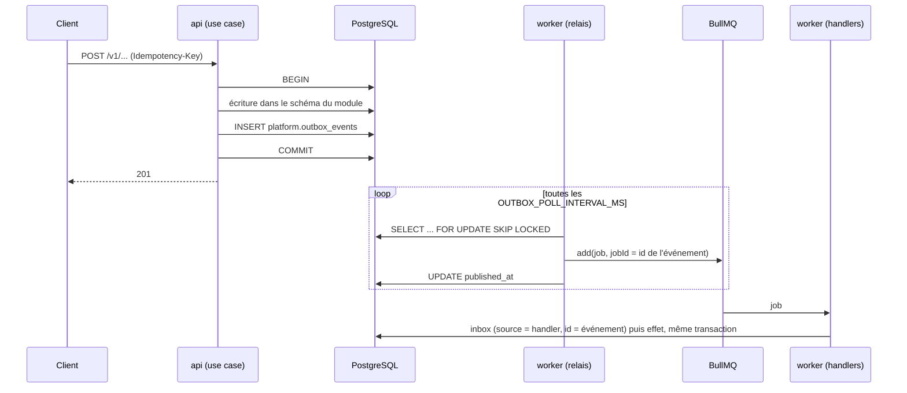
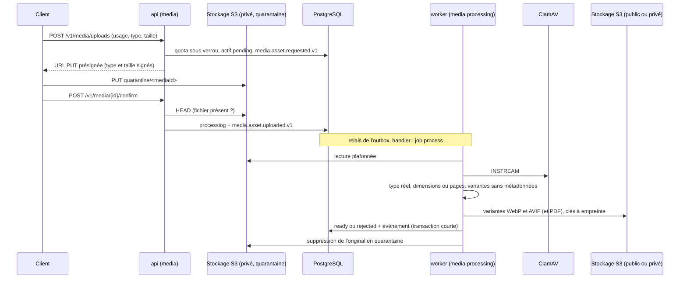
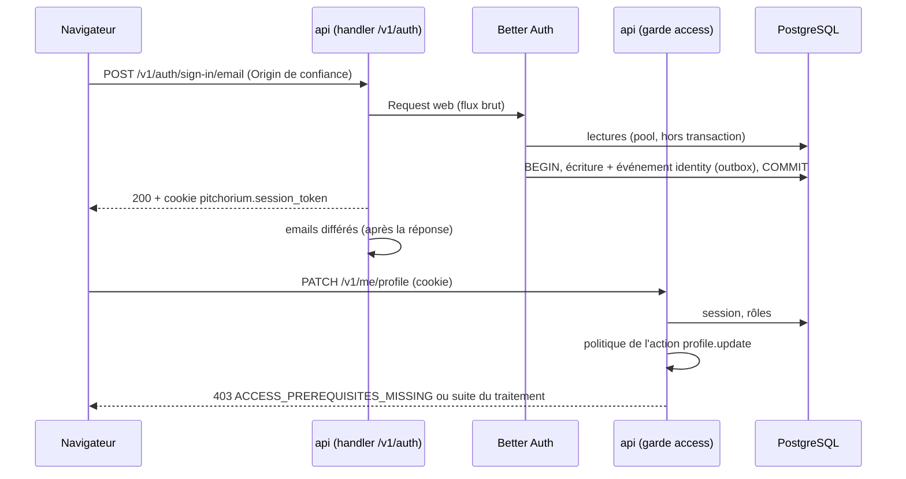

# Vue d'ensemble

Pitchorium est un monolithe modulaire NestJS (`apps/server`) accompagné de packages partagés. Un seul code, deux processus, une base PostgreSQL avec un schéma par module métier.

## Dépôt

```text
apps/
  server/            api et worker NestJS
packages/
  config/            presets TypeScript, ESLint (dont frontières), Prettier, Vitest
  contracts/         schémas Zod partagés (erreurs, pagination, argent, identifiants, locale, santé)
  db/                client Drizzle, schémas PostgreSQL, migrations, seed
  i18n/              catalogues de traduction et manifeste de relecture
  emails/            templates React Email
  api-client/        client fetch et hooks TanStack Query générés par Orval
infra/docker/        infrastructure locale (Compose)
docs/                produit, architecture, ADR, questions ouvertes
```

Le frontend (`apps/web`) n'existe pas encore. Il consommera `@pitchorium/api-client`, `@pitchorium/contracts` et `@pitchorium/i18n`.

## Les deux processus

| Processus | Point d'entrée       | Rôle                                                                                                 |
| --------- | -------------------- | ---------------------------------------------------------------------------------------------------- |
| api       | `src/main.api.ts`    | HTTP REST sous `/v1` (Express), Socket.IO (adaptateur Redis), Swagger UI sur `/docs` hors production |
| worker    | `src/main.worker.ts` | Workers BullMQ, relais de l'outbox, tâches planifiées, sonde de santé HTTP sur `WORKER_HEALTH_PORT`  |

Les deux processus chargent les mêmes modules métier, avec leurs providers propres au processus (`forApi()` ou `forWorker()`, voir `src/business-modules.ts`) ; le module racine diffère (`AppModule` ou `WorkerModule`) et `PlatformModule.forApi()` ou `.forWorker()` choisit les services techniques. `src/main.openapi.ts` exporte le document OpenAPI sans démarrer de serveur (mode `preview` de Nest : aucun provider instancié, aucune connexion).

## Composants



Redis sert au rate limiting, à l'adaptateur Socket.IO et à BullMQ. Les traces et Sentry ne sont actifs que si `OTEL_EXPORTER_OTLP_ENDPOINT` ou `SENTRY_DSN` sont définis.

## Flux d'une écriture avec outbox



- L'événement existe si et seulement si l'écriture métier est validée.
- Le relais peut tourner sur plusieurs workers (`SKIP LOCKED`). Un échec de publication incrémente `attempts` et repousse `next_attempt_at` (backoff exponentiel plafonné par `OUTBOX_MAX_BACKOFF_MS`).
- Un événement republié après un arrêt brutal ne crée pas de second job tant que le job est conservé (24 h) ; au-delà, l'inbox empêche un handler de s'exécuter deux fois.
- L'ordre de traitement entre événements n'est pas garanti.

## Téléversement et traitement d'un fichier



- Aucun appel au stockage ou à l'antivirus ne se fait dans une transaction (ADR 0019) ; le traitement est idempotent et réessayé par BullMQ.
- Les fichiers publics sont servis par le CDN (`S3_PUBLIC_BASE_URL`) avec un cache immuable ; les fichiers privés par URL présignée courte, après un contrôle délégué au module propriétaire de la ressource (ADR 0022).

## Authentification et autorisation



- `/v1/auth` est servi par Better Auth avant les body parsers (ADR 0013) ; toutes les autres routes passent par le garde global du module access (ADR 0015).
- Aucune transaction ne couvre un appel réseau (fournisseur OAuth, Have I Been Pwned) : chaque écriture de Better Auth est validée avec son événement dans une transaction courte (ADR 0019).
- Le handshake Socket.IO est authentifié par la même session ; seul le namespace `/system` reste anonyme.
- `pnpm admin:create --email <email>` attribue le rôle `admin` à un compte existant ; c'est le seul moyen de créer le premier administrateur.

## Arrêt propre

Sur SIGTERM, Nest déclenche les hooks d'arrêt : l'api cesse d'accepter des connexions et termine les requêtes en cours ; le worker arrête le relais, laisse les workers BullMQ finir leurs jobs ; puis les connexions PostgreSQL, Redis, S3, SMTP et l'exporteur OpenTelemetry sont fermés.

## Cibles de déploiement

| Composant     | Cible                                                                                            |
| ------------- | ------------------------------------------------------------------------------------------------ |
| api           | Conteneur sans état, plusieurs instances derrière un load balancer (`TRUST_PROXY_HOPS` à régler) |
| worker        | Conteneur sans état, une ou plusieurs instances, sonde sur `WORKER_HEALTH_PORT`                  |
| PostgreSQL 17 | Service managé, extensions `pg_trgm`, `unaccent`, `citext` autorisées                            |
| Redis         | Service managé compatible Redis (Valkey), politique `noeviction`                                 |
| Stockage      | Cloudflare R2 : bucket public (domaine personnalisé, `S3_PUBLIC_BASE_URL`) et bucket privé       |
| Emails        | Resend (`MAIL_TRANSPORT=resend`)                                                                 |
| Antivirus     | Conteneur ClamAV joignable par le worker (`CLAMAV_HOST`, `CLAMAV_PORT`)                          |
| Web           | `apps/web`, étape ultérieure, servi séparément de l'api                                          |

L'hébergeur n'est pas choisi (voir `docs/open-questions.md`). Les migrations s'appliquent avant le déploiement de l'api et du worker avec `pnpm db:migrate`.
