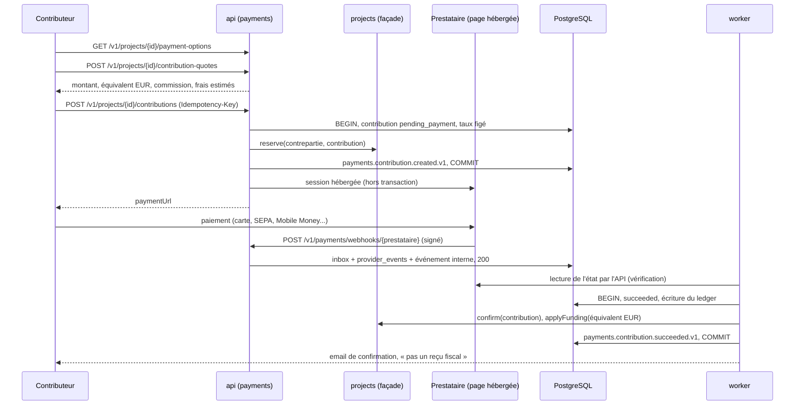

# Paiements : contributions, rails, ledger et rapprochement

Le module payments encaisse les contributions (§9) sans jamais détenir les fonds : le contributeur paie sur la page hébergée d'un prestataire agréé, qui verse au porteur et prélève la commission à la source (ADR 0043). Le module engagement en tire le tableau de bord d'impact (§9.4, ADR 0053). Les hypothèses à valider par un conseil juridique sont dans `payments-compliance.md`.

## Flux d'une contribution

- La contribution est créée, et la contrepartie réservée, avant l'appel au prestataire ; un échec de création de session la passe à `failed` et libère la contrepartie.
- Aucun webhook n'est cru sur parole : le worker relit la session ou la transaction par l'API du prestataire et applique l'état lu (montant, devise et référence comparés à la contribution). Un écart n'est jamais appliqué : il devient un écart de rapprochement.
- L'application est idempotente et indifférente à l'ordre : succès, frais, remboursements puis litiges, chacun une seule fois (écriture du ledger unique par type et source, `applyFunding` et `reverseFunding` idempotentes, réservation idempotente).
- Retour du contributeur : `POST /v1/me/contributions/{id}/return` relit l'état chez le prestataire, sans attendre le webhook.
- Expiration : la session expire après `PAYMENTS_SESSION_TTL_MINUTES` (30 à 1 440 minutes, bornes communes à Stripe Checkout et Flutterwave Standard) ; la contrepartie est réservée pour la même durée. La tâche `expire-pending` (toutes les 5 minutes) interroge le prestataire deux minutes après l'échéance, puis expire la contribution et libère la contrepartie. La tâche `release-orphans` (toutes les 15 minutes) libère les réservations restées attachées à une contribution terminée.

### Machine à états

| Depuis               | Vers                                                                |
| -------------------- | ------------------------------------------------------------------- |
| `pending_payment`    | `succeeded`, `failed`, `expired`, `canceled`                        |
| `succeeded`          | `partially_refunded`, `refunded`, `disputed`                        |
| `partially_refunded` | `partially_refunded`, `refunded`, `disputed`                        |
| `disputed`           | `dispute_won`, `dispute_lost`                                       |
| `dispute_won`        | `partially_refunded`, `refunded`, `disputed`                        |
| autres               | aucun (`failed`, `expired`, `canceled`, `refunded`, `dispute_lost`) |

`partially_refunded` sépare les remboursements partiels du remboursement total ; `canceled` est l'abandon par le contributeur avant paiement (`POST /v1/me/contributions/{id}/cancel`).

### Effets

- Succès : écriture `payment_succeeded`, `applyFunding` de l'équivalent EUR (sans case à cocher, §9.3 étape 5), `confirm` de la contrepartie, événement, email de confirmation.
- Remboursement (administrateur, ou décision de modération par `PaymentsFacade.refundForModeration`) : écriture `refund`, commission remboursée au prorata (arrondie au supérieur), `reverseFunding` de la part EUR (arrondie à l'inférieur, la dernière part donnant le reste), libération de la contrepartie au remboursement total.
- Litige : `dispute_opened` à l'ouverture ; gagné, contre-écriture `dispute_won` ; perdu, `dispute_lost` et `reverseFunding` de la part EUR.

## Choix du versement (ADR 0043, 0134)

Le rail d'un projet découle du compte de versement actif de son porteur, jamais du contributeur, du pays du profil ni du pays du projet. Le porteur choisit le prestataire et le pays de son compte parmi les combinaisons de la couverture publique ; un porteur établi au Sénégal qui détient un compte bancaire éligible en France ouvre un compte de versement en France.

- `POST /v1/me/payout-account` (`payment.payout.configure`) : `provider`, `country`, `eligibilityConfirmed: true` (le porteur confirme remplir les conditions du prestataire pour ce pays), `bankAccount` pour un prestataire `bank_details`. Une combinaison non couverte (prestataire inactif, pays non vérifié) : `422 PAYMENTS_PAYOUT_COUNTRY_NOT_SUPPORTED`. L'option du compte existant reprend ce compte (`200`, nouveau lien d'onboarding s'il est hébergé et inachevé) ; une autre option : `409 PAYMENTS_PAYOUT_ACCOUNT_EXISTS`.
- `PUT /v1/me/payout-account` (`payment.payout.change`, session récente) : change d'option. Un nouveau compte est ouvert chez le prestataire choisi et remplace l'ancien, qui reste chez son prestataire pour les contributions déjà reçues (chaque contribution garde son compte : remboursements, litiges et rapprochement ne changent pas) ; le pays d'un compte Stripe ne change jamais. Audit `payments.payout-account-changed` (ancien et nouveau prestataire, pays, référence de l'ancien compte), événement `payments.payout-account.onboarded.v1` ou `payments.payout-account.updated.v1` (`fields: provider, country`).
- Refus de changement, `409 PAYMENTS_PAYOUT_CHANGE_REFUSED` avec `reason` : `same_option` (option actuelle) ; `campaign_in_progress` (un projet du porteur est en `funding` ou `funded` et le compte actuel encaisse : actif, couvert, KYC vérifié), pour qu'une campagne ne soit pas partagée entre deux rails ni deux devises ; `payments_pending` (des sessions de paiement sont en attente sur le compte actuel). Reprise : après la clôture de la campagne et la fin des paiements en attente. Un compte qui n'encaisse plus (plus couvert, restreint, KYC manquant) peut changer pendant une campagne : aucune contribution n'y passe.
- La vue du compte donne `provider`, `covered` (la couverture vérifiée sert encore ce prestataire et ce pays), `collectionOpen` (couvert, actif et KYC vérifié) et `changeRefusal` (raison d'un refus maintenant, ou `null`). L'élément d'accès `payout_account` exige un compte actif et couvert.
- KYC : la vérification manuelle approuvée vaut pour la personne et reste acquise après un changement ; la vérification de Stripe vaut pour son compte.

Avec `PAYMENTS_MODE=simulated` (développement, tests, refusé en production), le prestataire simulé remplace les deux rails et sert leurs pays de versement vérifiés, réglés en EUR ; son Mobile Money n'est proposé qu'aux contributeurs des pays où un rail réel l'a vérifié (ADR 0052).

## Options côté contributeur (ADR 0135)

L'écran « Contribuer » reçoit `GET /v1/projects/{id}/payment-options` (`payment.quote`), avec le pays du contributeur (`country`, sinon le pays déclaré du profil) et, au besoin, la devise (`currency`) et le montant en unités mineures (`amountMinor`, qui exige `currency`).

- `availability` : `open` ; `campaign_closed` (campagne clôturée) ; `funding_frozen` (contributions gelées par la modération) ; `holder_without_covered_payout_account` (aucun compte, ou un compte que la couverture ne sert plus) ; `holder_not_verified` (compte couvert, mais pas actif ou identité non vérifiée). Vérifiés dans cet ordre.
- `rail` : prestataire, pays et devise du compte de versement du porteur, `null` sans compte couvert. Le front choisit de l'afficher ou non (§9.2).
- `currencies` : moyens disponibles par devise, avec opérateurs et bornes de chaque moyen (bornes de la plateforme converties au taux du moment, resserrées par les bornes vérifiées du prestataire) ; vide si le projet n'est pas ouvert.
- `unavailableMethods` : chaque autre moyen qu'un prestataire actif propose, avec son motif, examiné dans cet ordre : `not_covered_by_holder_rail` (le rail du porteur ne le propose pas, ou pas dans sa devise de versement pour un prestataire qui n'encaisse que celle-ci), `contributor_country_not_covered`, `currency_not_supported` (pas dans la devise demandée, ou devise sans taux), `amount_out_of_range`.
- `acceptsPayments` : le projet est ouvert et au moins un moyen est disponible pour ce contributeur.

Le devis et la création d'une contribution passent par la même évaluation (`domain/payment-options.ts`) :

- projet : `PAYMENTS_PROJECT_NOT_OPEN` (`reason` : `campaign_closed`, `funding_frozen`), `PAYMENTS_HOLDER_PAYOUT_NOT_COVERED` (`holder_without_covered_payout_account`), `PAYMENTS_HOLDER_NOT_READY` (`holder_not_verified`) ;
- moyen demandé indisponible : `PAYMENTS_METHOD_NOT_AVAILABLE` avec le motif des options (`reason`), montant compris ;
- devis sans moyen : `PAYMENTS_AMOUNT_OUT_OF_RANGE` (`amount_out_of_range`) si le montant seul empêche le paiement, sinon `PAYMENTS_CURRENCY_NOT_AVAILABLE` avec le motif du moyen le plus proche.

## Matrice de capacités

Données de configuration versionnées : `apps/server/src/modules/payments/domain/capability-matrix.ts` (`CAPABILITY_MATRIX_VERSION = 2026-10-10`). Chaque entrée porte ses sources ; une capacité non confirmée par la documentation officielle est `verified: false` et n'est jamais proposée. Capacités vérifiées le 2026-10-07, conditions d'éligibilité le 2026-10-10 (`CAPABILITY_MATRIX_VERIFIED_AT = 2026-10-07` : toute entrée l'a été à cette date ou après). Opérateurs de Mobile Money en codes stables (`mtn`, `orange_money`, `moov`, `wave`, `mpesa`, `airtel`, `telecel`, `airteltigo`, `mobicash`).

### Stripe Connect

| Capacité                    | Valeur retenue                                                                                                                                                       | Source                                                                                                                                                                                         |
| --------------------------- | -------------------------------------------------------------------------------------------------------------------------------------------------------------------- | ---------------------------------------------------------------------------------------------------------------------------------------------------------------------------------------------- |
| Pays de versement           | Zone euro où Stripe est disponible : AT, BE, BG, HR, CY, EE, FI, FR, DE, GR, IE, IT, LV, LT, LU, MT, NL, PT, SK, SI, ES ; versement en EUR                           | stripe.com/global, docs.stripe.com/connect/charges                                                                                                                                             |
| Non retenus                 | NG, KE, GH, ZA, CI (« extended network » par Paystack) ; SN, CM (absents) ; GB, CH et EEE hors zone euro (règlement dans une autre devise, conversion non modélisée) | stripe.com/global, docs.stripe.com/connect/cross-border-payouts (versements transfrontaliers d'une plateforme EEE limités aux US, UK, EEE, CA, CH, et incompatibles avec les charges directes) |
| Devise de paiement          | EUR                                                                                                                                                                  | docs.stripe.com/currencies                                                                                                                                                                     |
| Carte                       | Oui, minimum 0,50 EUR, maximum 12 chiffres                                                                                                                           | docs.stripe.com/currencies                                                                                                                                                                     |
| SEPA Direct Debit           | Oui, notification différée (succès environ 6 jours ouvrés après), 10 000 EUR par transaction                                                                         | docs.stripe.com/payments/sepa-debit                                                                                                                                                            |
| Apple Pay, Google Pay       | Oui, affichés par Checkout sur les appareils et pays pris en charge                                                                                                  | docs.stripe.com/payments/payment-methods/payment-method-support                                                                                                                                |
| PayPal                      | Non : pas de charges directes avec Connect                                                                                                                           | docs.stripe.com/payments/payment-methods/payment-method-connect-support                                                                                                                        |
| Frais estimés (compte FR)   | Carte, Apple Pay, Google Pay : 1,5 % + 0,25 EUR (cartes EEE standard) ; SEPA : 0,35 EUR                                                                              | stripe.com/fr/pricing                                                                                                                                                                          |
| Frais estimés (autres pays) | Non vérifiés : devis sans estimation                                                                                                                                 |                                                                                                                                                                                                |

### Flutterwave (API v3)

| Capacité                        | Valeur retenue                                                                                                                                                                                                                       | Source                                                   |
| ------------------------------- | ------------------------------------------------------------------------------------------------------------------------------------------------------------------------------------------------------------------------------------ | -------------------------------------------------------- |
| Pays de versement (sous-compte) | NG (NGN), GH (GHS), RW (RWF), TZ (TZS), UG (UGX)                                                                                                                                                                                     | developer.flutterwave.com/v3.0/docs/split-payments       |
| Non retenus                     | KE, CI, SN, BF, CM, ZA : sous-comptes de collecte non documentés pour ces pays                                                                                                                                                       | idem                                                     |
| Devise de paiement              | Celle du compte de versement uniquement : le partage d'un paiement en EUR, GBP ou USD vers un sous-compte réglé en devise africaine n'est pas documenté                                                                              | developer.flutterwave.com/v3.0/docs/payment-methods      |
| NGN                             | Carte (tous pays), virement, compte bancaire, USSD (contributeurs au Nigeria)                                                                                                                                                        | idem                                                     |
| GHS                             | Carte ; Mobile Money MTN, Telecel, AirtelTigo (contributeurs au Ghana)                                                                                                                                                               | developer.flutterwave.com/v3.0/docs/ghana                |
| UGX                             | Carte ; Mobile Money MTN, Airtel (contributeurs en Ouganda)                                                                                                                                                                          | developer.flutterwave.com/v3.0/docs/uganda               |
| RWF, TZS                        | Carte ; Mobile Money non retenu (opérateurs de collecte non documentés)                                                                                                                                                              | developer.flutterwave.com/v3.0/docs/payment-methods      |
| XOF, XAF, KES (Mobile Money)    | CI : MTN, Orange Money, Moov, Wave ; SN : Orange Money, Wave ; BF : Orange Money, Mobicash ; CM : MTN, Orange Money ; KE : M-Pesa. Vérifiés côté collecte, inaccessibles tant qu'aucun pays de versement correspondant n'est vérifié | developer.flutterwave.com/v3.0/docs/francophone, /m-pesa |
| Montants minimum et maximum     | Non documentés : bornes de la plateforme seulement                                                                                                                                                                                   |                                                          |
| Frais estimés (NG)              | 2 % (1,4 % + 0,6 %) + TVA 7,5 % sur les frais ; autres pays non vérifiés                                                                                                                                                             | flutterwave.com/ng/pricing                               |
| Taux de change                  | `GET /v3/transfers/rates`, indicatif (« estimation », mis à jour plusieurs fois par jour)                                                                                                                                            | developer.flutterwave.com/v3.0/docs/transfer-rates       |

Le paramètre `payment_options` de Flutterwave Standard n'est pas envoyé : ses valeurs pour le Mobile Money francophone diffèrent entre deux tableaux de la documentation ; la page hébergée filtre elle-même les moyens par devise.

### Éligibilité des porteurs

Ce que chaque prestataire demande pour ouvrir un compte de versement, en codes (`PAYOUT_REQUIREMENTS`, `PAYOUT_DOCUMENTS` de `packages/contracts`), portée `all` ou `company` (compte ouvert au nom d'une société). Vérifié le 2026-10-10.

| Prestataire | Conditions                                                                                                                                                                                                                                                                               | Pièces                                                                                                                               | Source                                                                                                                                                                                                                                                                                     |
| ----------- | ---------------------------------------------------------------------------------------------------------------------------------------------------------------------------------------------------------------------------------------------------------------------------------------- | ------------------------------------------------------------------------------------------------------------------------------------ | ------------------------------------------------------------------------------------------------------------------------------------------------------------------------------------------------------------------------------------------------------------------------------------------ |
| Stripe      | Adresse physique dans le pays du compte, où recevoir du courrier, pas une boîte postale ; compte bancaire dans ce pays ; téléphone ; site présentant l'activité ; acceptation du contrat Stripe. Société : immatriculée dans le pays du compte, numéro fiscal. Pays du compte définitif. | Pièce d'identité officielle ; passeport si le pays de résidence diffère du pays du compte. Société : justificatif d'immatriculation. | support.stripe.com/questions/requirements-to-open-a-stripe-account-in-another-country, docs.stripe.com/acceptable-verification-documents, docs.stripe.com/connect/required-verification-information, support.stripe.com/questions/stripe-account-country-can-t-be-changed-after-activation |
| Flutterwave | Compte bancaire du pays du sous-compte (« the country the bank account is in »), nom de l'activité, téléphone ; la plateforme vérifie elle-même ses marchands                                                                                                                            | Revue manuelle de Pitchorium (ADR 0050) : pièce d'identité ; liste par pays à fixer (question 57)                                    | developer.flutterwave.com/v3.0/docs/split-payments                                                                                                                                                                                                                                         |

Un porteur établi au Sénégal peut donc ouvrir un compte Stripe en France s'il y a une adresse et un compte bancaire, avec son passeport ; un compte Flutterwave au Nigeria avec un compte bancaire nigérian.

## Couverture publique (ADR 0133)

`GET /v1/public/payments/coverage`, sans session, `Cache-Control: public, max-age=3600` (la matrice ne change qu'au déploiement) : version et date de vérification de la matrice ; pour chaque prestataire actif (`PAYMENTS_MODE` et identifiants), dans l'ordre de la matrice : mode d'onboarding et de KYC, règle des devises (`payout_currency` ou `any`), pays de versement vérifiés et leur devise, devises de versement et de paiement, paiements (devise, moyen, opérateurs, pays des contributeurs ou `null` pour tous, bornes vérifiées ou `null`), éligibilité. Seules les capacités vérifiées et atteignables figurent : une capacité `verified: false`, un prestataire inactif, ou un paiement dans une devise qu'aucun pays de versement vérifié ne règle (Mobile Money francophone de Flutterwave) n'apparaissent pas. Uniquement des codes (prestataire, pays ISO 3166-1, devise ISO 4217, moyen, opérateur, condition, pièce), libellés par `packages/i18n` (`reference`).

## Devises et conversion (ADR 0046)

- `Money` connaît l'exposant ISO 4217 de chaque devise (EUR 2, XOF et XAF 0).
- Chaque contribution enregistre le montant payé dans sa devise, l'équivalent EUR figé à la création de la session, le taux (unités pour un euro, en chaîne décimale), sa source (`identity`, `fixed_parity`, `provider`, `simulated`) et son horodatage.
- XOF et XAF : parité fixe de 655,957 francs pour un euro, en arithmétique entière exacte, arrondi au centime le plus proche, demi vers le haut. 65 596 XOF donnent 100,00 EUR.
- Autres devises : taux du prestataire (`FxRateProvider`), figé pour la session ; l'équivalent EUR de règlement remplace le taux figé quand le prestataire en fournit un (aucun des deux prestataires vérifiés n'en fournit aujourd'hui).
- Les minimums des contreparties sont comparés à l'équivalent EUR.
- Les montants envoyés à Flutterwave sont écrits comme littéraux numériques à partir de chaînes décimales, et ses réponses sont lues en conservant le texte exact des nombres : aucun flottant.

## Commission et frais (ADR 0047)

- Commission : `PAYMENTS_COMMISSION_RATE_BPS` (500 = 5 %), versionnée par `PAYMENTS_COMMISSION_VERSION`, enregistrée sur chaque contribution ; assiette : le montant de la contribution ; arrondi à l'unité mineure inférieure, en faveur du porteur.
- Prélevée à la source : `application_fee_amount` (Stripe), charge `flat` du sous-compte (Flutterwave).
- Frais du prestataire supportés par le porteur ; estimés dans le devis à partir des grilles vérifiées (arrondi au supérieur), puis enregistrés quand le prestataire les communique (écriture `provider_fee`).

## Plan de comptes du ledger (ADR 0048)

Montants signés, en unités mineures, par devise ; chaque écriture s'équilibre par devise ; une écriture n'est jamais modifiée.

| Compte                | Sens                                                                    |
| --------------------- | ----------------------------------------------------------------------- |
| `contributor_funds`   | Payé par les contributeurs (négatif)                                    |
| `holder_share`        | Part du porteur, chez le prestataire puis sur son compte                |
| `platform_commission` | Commission de Pitchorium, prélevée par le prestataire                   |
| `provider_fees`       | Frais du prestataire, supportés par le porteur                          |
| `refunds`             | Rendu aux contributeurs                                                 |
| `disputes`            | Retenu par un litige                                                    |
| `offline_declared`    | Argent hors plateforme validé (négatif)                                 |
| `offline_receipts`    | Argent hors plateforme reçu par le porteur                              |
| `funding_sources`     | Mémo EUR : sources des montants collectés (négatif)                     |
| `project_funding`     | Mémo EUR : montant collecté d'un projet, égal à son total dans projects |

| Écriture            | Lignes                                                                                                                                       |
| ------------------- | -------------------------------------------------------------------------------------------------------------------------------------------- |
| `payment_succeeded` | `contributor_funds` −A ; `holder_share` A − C − F ; `platform_commission` C ; `provider_fees` F ; `funding_sources` −E ; `project_funding` E |
| `provider_fee`      | `holder_share` −F ; `provider_fees` F                                                                                                        |
| `refund`            | `refunds` R ; `holder_share` −(R − Cr) ; `platform_commission` −Cr ; `funding_sources` Er ; `project_funding` −Er                            |
| `dispute_opened`    | `disputes` D ; `holder_share` −D                                                                                                             |
| `dispute_won`       | Contre-écriture de l'ouverture                                                                                                               |
| `dispute_lost`      | `funding_sources` Ed ; `project_funding` −Ed                                                                                                 |
| `offline_validated` | `offline_declared` −V ; `offline_receipts` V ; `funding_sources` −E ; `project_funding` E                                                    |

A : montant payé ; C : commission ; F : frais ; E : équivalent EUR ; R, Cr, Er : montant, commission et part EUR remboursés ; D, Ed : montant et part EUR d'un litige ; V : montant hors plateforme.

## Webhooks et rapprochement

### Réception

- `POST /v1/payments/webhooks/stripe|flutterwave|simulated` : servi hors du routage Nest et avant les analyseurs de corps (corps brut), sans session ; absent du document OpenAPI et du client généré.
- Signature vérifiée sur le corps brut : Stripe, `Stripe-Signature` (HMAC SHA-256 de `t.corps`, tolérance 5 minutes) ; Flutterwave v3, `verif-hash` comparé au secret en temps constant ; simulé, `x-simulated-signature` sur le modèle de Stripe.
- Déduplication par l'inbox (`webhook:<prestataire>`, identifiant de l'événement ; pour Flutterwave v3, qui n'en fournit pas : type, transaction et statut), enregistrement dans `payments.provider_events` (références seulement) et événement interne `payments.provider-event.received.v1`, dans une transaction courte ; réponse 200 immédiate, 400 sur signature invalide, 500 si l'enregistrement échoue (le prestataire réessaie).
- Le worker met en file `sync-contribution` (ou `sync-payout-account` pour `account.updated` de Stripe), qui relit l'état chez le prestataire hors transaction (ADR 0019), puis l'applique. Une notification `chargeback.*` de Flutterwave ne nomme la transaction que par son `flw_ref` : le job `sync-payment-reference` retrouve la transaction par `GET /v3/chargebacks?flw_ref=`, puis la synchronise comme les autres.

### Litiges Flutterwave

- API v3 vérifiée dans la documentation officielle le 2026-10-07 (developer.flutterwave.com, chargebacks v3) : `GET /v3/chargebacks` filtrable par `flw_ref`, `from`, `to`, `status`, paginé (`meta.page_info`) ; chaque rétrofacturation porte `id`, `amount` (devise de la transaction), `status`, `stage`, `transaction_id`, `tx_ref`. Les webhooks `chargeback.initiated|accepted|declined|lost` ne sont actifs que sur demande à Flutterwave.
- La lecture d'une transaction réussie (`verify`) liste ses rétrofacturations par son `flw_ref` et les rapporte comme litiges : `initiated`, `pending` et `declined` (contestée par le marchand) restent ouverts ; `accepted` et `lost` sont perdus ; `won` et `reversed` sont gagnés. Les effets sont ceux d'un litige Stripe (ledger, `reverseFunding`, événements).
- Sans webhook, le rapprochement quotidien lit les rétrofacturations de la période et synchronise chaque contribution concernée avant ses contrôles.

### Rapprochement

- Tâche quotidienne `reconcile` (03:30 UTC), sur `PAYMENTS_RECONCILIATION_LOOKBACK_DAYS` jours ; à la demande : `POST /v1/admin/payments/reconciliation-runs` ou `pnpm payments:reconcile [--days N]`.
- Synchronisation préalable des paiements contestés que la lecture d'un paiement ne révèle pas (rétrofacturations Flutterwave de la période).
- Contrôles : chaque transaction listée par le prestataire contre sa contribution (existence, statut, montant, remboursements) ; chaque contribution payée contre une transaction ; chaque contribution payée contre ses lignes (`contributor_funds`, `refunds`) ; l'équilibre global du ledger ; le total de chaque projet contre `project_funding`.
- Un écart est enregistré (`payments.discrepancies`, unique tant qu'il est ouvert), journalisé en `error`, compté (`pitchorium.payments.reconciliation.discrepancy`, attributs `kind` et `provider`) et annoncé (`payments.reconciliation.discrepancy-detected.v1`). Aucune correction automatique : un administrateur le traite (`GET /v1/admin/payments/discrepancies`, `POST .../{id}/resolve` avec une note auditée).

## Anti-fraude et limites

- Bornes d'une contribution sur son équivalent EUR : `PAYMENTS_MIN_EUR_MINOR` et `PAYMENTS_MAX_EUR_MINOR` (1 EUR et 10 000 EUR, provisoires), plus les bornes du prestataire.
- Fréquence : `PAYMENTS_CONTRIBUTIONS_PER_HOUR` par contributeur et `PAYMENTS_SESSIONS_PER_METHOD_PER_HOUR` par contributeur et moyen (10 et 5, provisoires), `PAYMENTS_RATE_LIMITED` au-delà.
- Vérification renforcée : au-delà de `PAYMENTS_ENHANCED_VERIFICATION_EUR_MINOR` (1 000 EUR, provisoire), la double authentification est exigée (`ACCESS_PREREQUISITES_MISSING`, `two_factor`).
