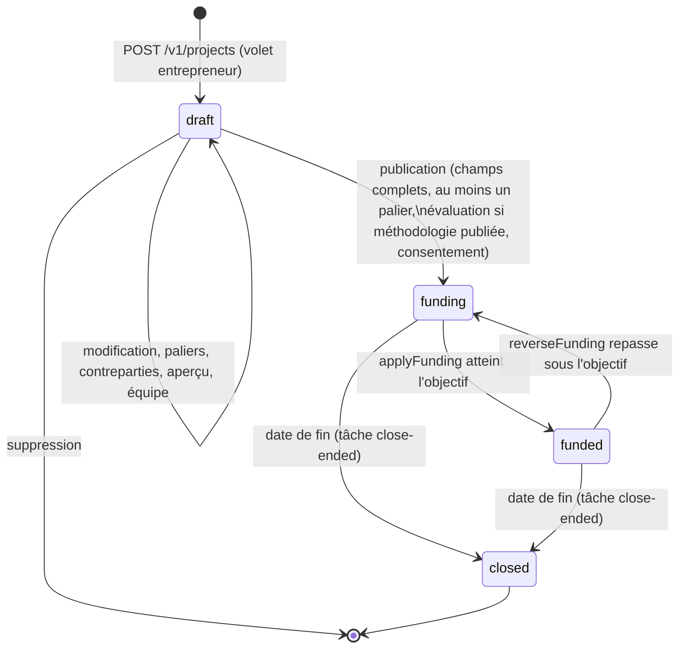
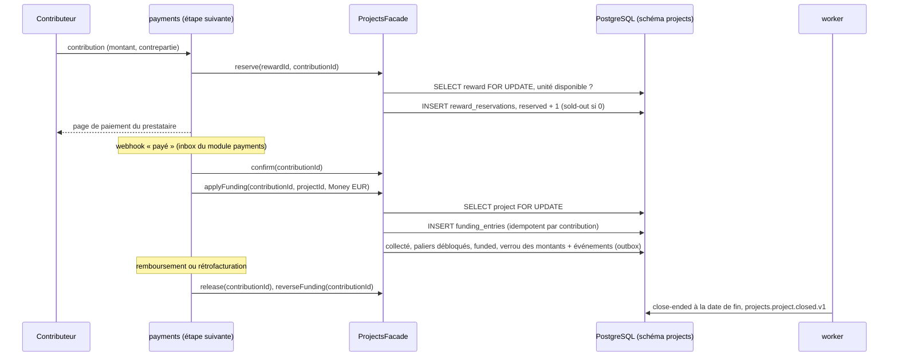

# Projets : cycle de vie et flux du financement

Le module projects porte les projets, leurs paliers, contreparties, actualités et manifestations d'intérêt ; le module impact, le score auto-déclaré ; le module payments (étape suivante) encaissera les contributions et appellera la façade de projects. projects ne lit aucune table d'un autre module : il passe par les façades de profiles, organizations, media, network, content et impact, et s'enregistre auprès de network, content, organizations et media au démarrage.

## Cycle de vie d'un projet

- La publication fixe `ends_at = published_at + duration_days` (pas de prolongation), enregistre le consentement d'affichage public du propriétaire (ADR 0040) et rend publiques la galerie et les images des actualités (ADR 0026).
- `funded` reste ouvert aux contributions jusqu'à la date de fin ; `closed` garde les paliers atteints (financement flexible, ADR 0038).
- Après la première contribution, l'objectif, les seuils et les minimums des contreparties sont verrouillés (ADR 0039).
- Quand la fin est à moins de `PROJECTS_ENDING_SOON_HOURS`, la tâche `announce-ending-soon` émet `projects.project.ending-soon.v1`, une seule fois.

## Flux du financement

- Toutes les méthodes de la façade sont idempotentes par identifiant de contribution : un webhook rejoué ne compte jamais deux fois.
- Les événements `projects.tier.unlocked.v1`, `projects.project.funded.v1` et `projects.project.closed.v1` sont écrits dans la même transaction que le montant (outbox) ; les notifications (§10.5 « palier débloqué ») les consommeront.
- Jusqu'au module payments, seuls les tests et `pnpm db:seed:dev` appellent `applyFunding`.

## Actualités et fil

Une actualité publiée par l'équipe est lue par les abonnés du projet (suivi de type `project`, ADR 0027) dans leur fil : le module projects enregistre auprès de content une source d'actualités, fusionnée avec les publications du réseau sur la même clé de pagination (ADR 0032). Une publication peut être rattachée à un projet par un membre de son équipe ; la page du projet liste ces publications par la façade de content.
