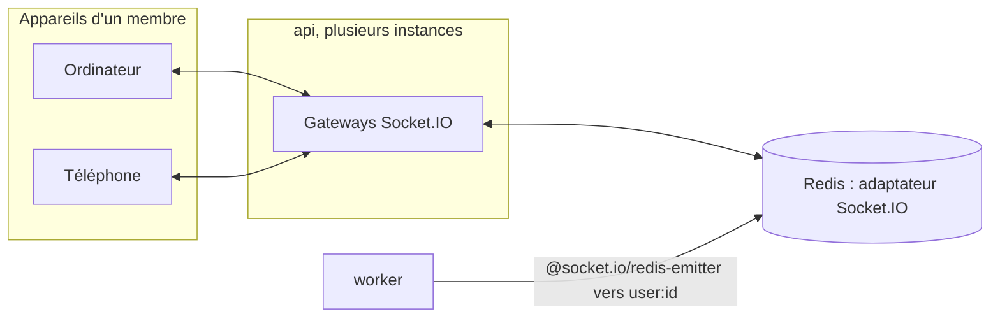

# Temps réel : protocole Socket.IO

Socket.IO 4 sur l'api, adaptateur Redis (plusieurs instances), émetteur Redis pour le worker. Schémas Zod des charges utiles : `packages/contracts/src/realtime.ts`, partagés par le serveur et le client. Décisions : ADR 0056 (fiabilité) et ADR 0057 (pas de chiffrement de bout en bout).

## Namespaces et connexion

| Namespace | Accès                                                                                       | Usage                                           |
| --------- | ------------------------------------------------------------------------------------------- | ----------------------------------------------- |
| `/`       | Session (cookie `pitchorium.session_token`) et `Origin` de confiance, vérifiés au handshake | Messagerie, notifications, compteurs            |
| `/system` | Anonyme                                                                                     | Vérification technique (`ping`, réponse `pong`) |

- Transport recommandé : `websocket` (repli sur le long polling possible).
- À la connexion, la socket rejoint la room `user:<id>` de son membre : tous ses appareils reçoivent les mêmes événements.
- Un événement poussé n'est qu'un raccourci : l'état fait foi par les routes HTTP et la synchronisation par séquence.



## Événements du client vers le serveur

Chaque événement à accusé répond `{ ok: true, result }` ou `{ ok: false, code }` (code d'erreur stable du registre, `VALIDATION_FAILED` pour une charge utile invalide).

| Événement          | Charge utile                                                                 | Accusé (`result`)                    |
| ------------------ | ---------------------------------------------------------------------------- | ------------------------------------ |
| `messaging:send`   | `conversationId`, `clientMessageId`, `body`, `attachmentIds`, `sharedPostId` | message enregistré (`messageSchema`) |
| `messaging:sync`   | `conversationId`, `afterSequence`, `limit` (100 au plus)                     | `{ items, lastSequence, hasMore }`   |
| `messaging:read`   | `conversationId`, `sequence`                                                 | `{ sequence }` (position conservée)  |
| `messaging:typing` | `conversationId`                                                             | aucun accusé, rien n'est stocké      |

`messaging:send` exige des conditions d'utilisation acceptées, comme les routes HTTP ; le premier message à un membre passe par `POST /v1/messaging/conversations`.

## Événements du serveur vers le client

| Événement                    | Charge utile                                                                                                          | Destinataires                           |
| ---------------------------- | --------------------------------------------------------------------------------------------------------------------- | --------------------------------------- |
| `messaging:message`          | `{ message }`, tel que chaque destinataire peut le voir                                                               | participants actifs, expéditeur compris |
| `messaging:message-updated`  | `{ message }` après modification ou suppression (pierre tombale)                                                      | participants actifs                     |
| `messaging:read`             | `{ conversationId, handle, mine, sequence }`                                                                          | participants actifs                     |
| `messaging:typing`           | `{ conversationId, handle }`                                                                                          | autres participants actifs              |
| `messaging:conversation`     | `{ conversationId, change }` : `created`, `request_received`, `request_accepted`, `state_changed`, `participant_left` | membres concernés, à relire par HTTP    |
| `notifications:notification` | `{ notification }`, créée ou regroupée                                                                                | destinataire                            |
| `counters`                   | `{ counters }` : notifications, messages non lus, demandes de message, invitations en attente                         | membre concerné, à chaque changement    |

## Envoi, diffusion et synchronisation

```mermaid
sequenceDiagram
  participant A as Appareil de l'expéditeur
  participant API as api (gateway)
  participant DB as PostgreSQL
  participant R as Redis
  participant B1 as Appareil 1 du destinataire
  participant B2 as Appareil 2 (hors ligne)
  A->>API: messaging:send (clientMessageId)
  API->>DB: BEGIN ; séquence suivante (verrou de la conversation)
  API->>DB: INSERT message + outbox messaging.message.sent.v1 ; COMMIT
  API-->>A: accusé { ok, result: message }
  API->>R: publication vers user:A et user:B
  R-->>B1: messaging:message
  Note over B2: reconnexion
  B2->>API: messaging:sync (afterSequence = dernière connue)
  API-->>B2: messages manquants, dans l'ordre
```

- Un envoi rejoué avec le même `clientMessageId` rend le même message (déduplication) ; avec un autre contenu, `MESSAGING_CLIENT_ID_REUSED`.
- Les séquences d'une conversation commencent à 1 et n'ont pas de trou : un client qui voit un écart demande `messaging:sync`.
- Les accusés de lecture ne reculent jamais ; `mine: true` signale aux autres appareils du lecteur que la conversation est lue.

## Côté serveur

- `platform/realtime` : `MembersGateway` (room `user:<id>`), `RealtimePublisher` (port, adaptateur `@socket.io/redis-emitter`, utilisable par l'api et le worker), `RedisIoAdapter` (garde du handshake fourni par access).
- `modules/messaging/interface/messaging.gateway.ts` : événements de la messagerie ; `modules/notifications` pousse notifications et compteurs depuis le worker.
