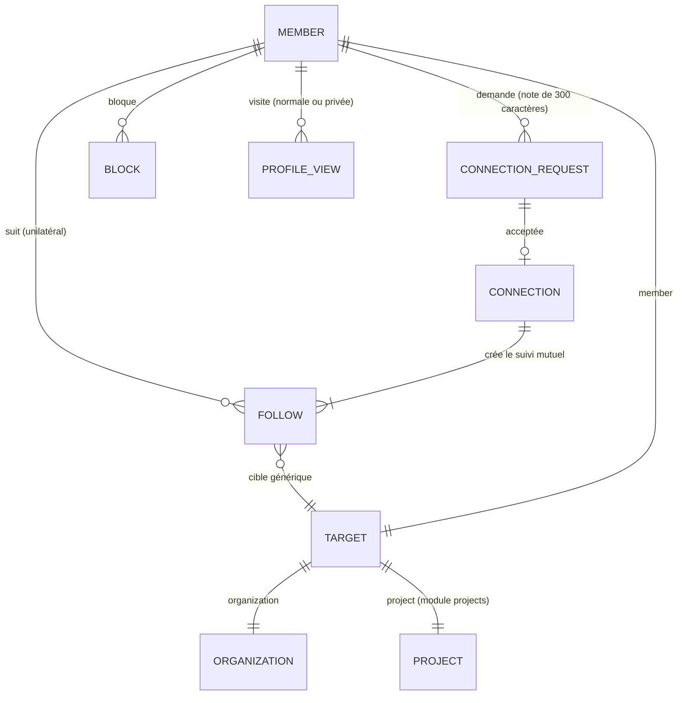
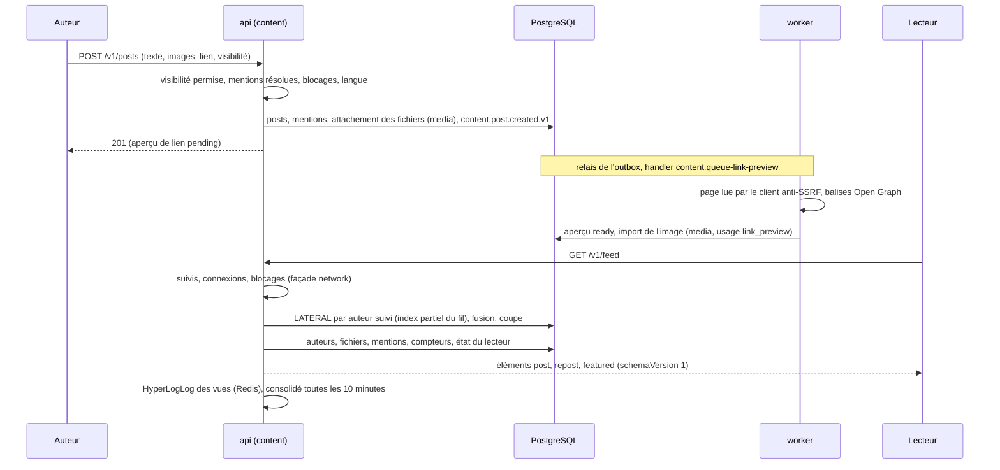

# Graphe social et fil d'actualité

Le module network porte le graphe social (suivis, connexions, blocages, vues de profil), le module content les publications et le fil. content lit le graphe par la façade de network, jamais par ses tables ; les vues de profil sont signalées par profiles à network par un point d'extension.

## Modèle du graphe

- Suivi : `network.follows` (abonné, `target_type`, `target_id`), types enregistrés par les modules propriétaires (ADR 0027).
- Connexion : demande unique en attente par paire, acceptation, une ligne par sens dans `network.connections`, suivi mutuel d'origine `connection` (ADR 0028).
- Blocage : supprime connexion, suivis et demandes entre les deux membres, masque leurs contenus et interdit les interactions (ADR 0029).
- Relation affichée sur un profil : degré jusqu'au 2e, connexions en commun plafonnées, état de la connexion, suivis, blocage.
- Vues de profil : tampon Redis dédupliqué par jour, écriture par lots par le worker, visite privée anonymisée (ADR 0030).

## Flux d'une publication jusqu'au fil

## Règles appliquées à la lecture

- Visibilité effective : `public` se lit `members` si l'auteur a désactivé sa page publique (ADR 0031).
- Audience : `public` (aussi sans compte), `members`, `connections` (auteur et connexions).
- Blocages dans les deux sens, publications masquées par le lecteur, statut de modération (`hidden` visible de l'auteur seul, `removed` de personne).
- Repartage : jamais au-delà de l'audience de l'original ; l'original invisible donne `repostOf: null`.
- Complément éditorial quand le réseau produit moins que le seuil configuré, jamais de fil mondial anonyme (ADR 0032).
